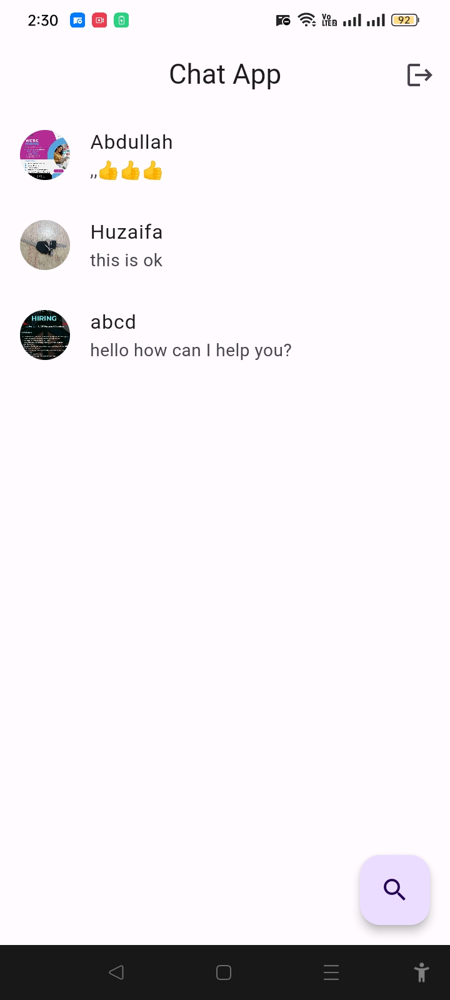
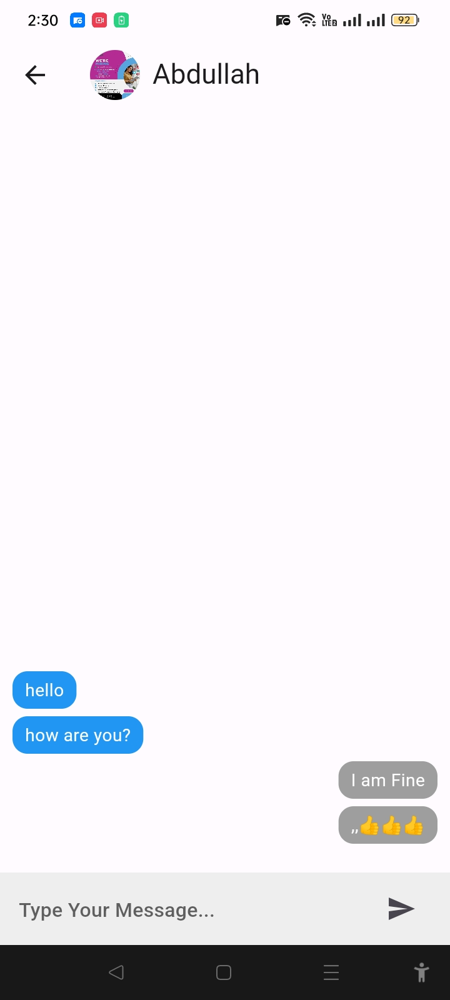

# Chat App with Firebase

## Tech Stack

- Flutter
- Firebase

## Packagages

- cupertino_icons: ^1.0.6
- firebase_core: ^2.29.0
- firebase_auth: ^4.19.1
- cloud_firestore: ^4.16.1
- firebase_storage: ^11.7.1
- image_picker: ^1.0.8
- image_cropper: ^5.0.1
- uuid: ^4.4.0

## Screen Shots

